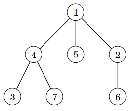

# 7. Puut ja rekursio

_Puu_ (_tree_) on tietorakenne, joka muodostuu eri tasoilla olevista _solmuista_ (_node_). Esimerkiksi seuraavassa puussa on seitsemän solmua:



Puun ylin solmu on nimeltään _juuri_ (_root_). Solmun _lapsi_ (_child_) on sen alapuolella oleva solmu, johon on yhteys solmusta. Solmun _vanhempi_ (_parent_) on solmu, jonka lapsi solmu on. Jos solmulla ei ole lapsia, se on _lehti_ (_leaf_).

Esimerkissä puun juuri on solmu 1. Solmun 1 lapset ovat solmut 4, 5 ja 2. Solmun 4 vanhempi on solmu 1. Puun lehtiä ovat solmut 3, 7, 5 ja 6.

Huomaa, että jokaisella solmulla juurta lukuun ottamatta on tarkalleen yksi vanhempi. Tämän vuoksi on olemassa yksikäsitteinen reitti juuresta mihin tahansa solmuun kulkemalla yhteyksiä alaspäin. Juurella ei ole vanhempaa.

Solmun _alipuu_ (_subtree_) sisältää solmut, joihin pääsee kulkemalla solmusta alaspäin yhteyksiä pitkin. Esimerkissä solmun 1 alipuu sisältää puun kaikki solmut ja solmun 4 alipuu sisältää solmut 4, 3 ja 7.

Solmun _syvyys_ (_depth_) tarkoittaa, miten matalalla solmu on puussa. Juuren syvyys on 0 ja muilla solmuilla syvyys on yhtä suurempi kuin niiden vanhemman syvyys. Esimerkissä solmun 1 syvyys on 0, solmun 4 syvyys on 1 ja solmun 3 syvyys on 2.

Puun _korkeus_ (_height_) on suurin puussa esiintyvä solmun syvyys. Esimerkissä puun korkeus on 2, koska solmujen 3, 7 ja 6 syvyys on 2.

## Puun käsittely

Voimme esittää puun solmun Pythonissa seuraavan luokan `Node` avulla:

```python
class Node:
    def __init__(self, value, children=None):
        self.value = value
        self.children = [] if children is None else children
        
    def __repr__(self):
        return str(self.value)        
```

Tässä kentässä `value` on solmuun liittyvä arvo ja lista `children` sisältää viittaukset solmun lapsiin. Oletuksena `children` on tyhjä eli solmulla ei ole lapsia.

Nyt voimme määritellä seuraavasti äskeisen esimerkkipuun:
        
```python
tree = Node(1, [Node(4, [Node(3), Node(7)]),
                Node(5),
                Node(2, [Node(6)])])
```

Luonteva tapa käsitellä puuta on käyttää rekursiota. Esimerkiksi seuraava funktio `traverse` käy läpi kaikki solmut, jotka ovat solmun `node` alipuussa:

```python
def traverse(node):
    print(node.value)
    for child in node.children:
        traverse(child)
```

Kun funktiolle annetaan viittaus puun juureen, funktio käy läpi kaikki puun solmut:

```python
traverse(tree)
```

Esimerkkipuussa funktion tulostus on seuraava:

```
1
4
3
7
5
2
6
```

Funktio `traverse` tulostaa ensin sille annetun solmun arvon (`node.value`). Tämän jälkeen funktio käy läpi kaikki solmun lapset (`node.children`) ja kutsuu jokaisen lapsen kohdalla itseään rekursiivisesti.

Voimme vielä selventää funktion toimintaa muuttamalla sitä seuraavasti:

```python
def traverse(node):
    print("enter", node.value)
    for child in node.children:
        traverse(child)
    print("leave", node.value)
```

Nyt funktio tulostaa "enter $$x$$", kun solmun $$x$$ käsittely alkaa, ja "leave $$x$$", kun solmun $$x$$ käsittely päättyy. Esimerkkipuussa funktio tulostaa:

```
enter 1
enter 4
enter 3
leave 3
enter 7
leave 7
leave 4
enter 5
leave 5
enter 2
enter 6
leave 6
leave 2
leave 1
```

## Tiedon laskeminen puusta

Puita käsitellään usein funktioilla, jotka laskevat rekursiivisesti jonkin puuhun liittyvän tiedon. Tarkastellaan esimerkkinä funktiota `count_nodes`, joka laskee, montako solmua on solmun `node` alipuussa:

```python
def count_nodes(node):
    result = 1
    for child in node.children:
        result += count_nodes(child)
    return result
```

Funktiota voidaan käyttää näin:

```python
tree = Node(1, [Node(4, [Node(3), Node(7)]),
                Node(5),
                Node(2, [Node(6)])])

print(count_nodes(tree)) # 7
```

Funktio laskee solmujen määrän muuttujaan `result`. Muuttujan alkuarvo on 1, jolloin siihen on laskettu mukaan solmu `node`. Tämän jälkeen funktio käy läpi solmun lapset ja laskee mukaan rekursiivisesti solmujen määrät lasten alipuissa. Lopuksi funktio palauttaa solmujen määrän.

Katsotaan tarkemmin, miten funktio laskee solmujen määrän esimerkissä:


Kun funktiolle annetaan viittaus solmuun 1, muuttuja `result` on alussa 1 ja funktio lisää siihen silmukassa solmun 1 lasten solmujen määrät. Solmun 1 lapset ovat solmut 4, 5 ja 2. Solmun 4 alipuussa on 3 solmua, solmun 5 alipuussa on 1 solmu ja solmun 2 alipuussa on 2 solmua. Niinpä muuttujaan `result` lisätään määrät 3, 1 ja 2 ja solmujen määräksi saadaan 1 + 3 + 1 + 2 = 7.

Voimme vielä selventää funktion toimintaa lisäämällä siihen tulostusta:

```python
def count_nodes(node):
    result = 1
    for child in node.children:
        result += count_nodes(child)
    print("subtree of node", node, "has", result, "nodes")
    return result
```

Tämän muutoksen jälkeen funktio tulostaa jokaisesta solmusta tiedon, montako solmua sen alipuussa on:

```
subtree of node 3 has 1 nodes
subtree of node 7 has 1 nodes
subtree of node 4 has 3 nodes
subtree of node 5 has 1 nodes
subtree of node 6 has 1 nodes
subtree of node 2 has 2 nodes
subtree of node 1 has 7 nodes
```

Monia puihin liittyviä asioita voidaan laskea samalla idealla: määritellään sopivat muuttujat, käydään läpi silmukassa solmun lapset rekursiivisesti ja päivitetään muuttujia sopivalla tavalla. Esimerkiksi seuraava funktio `count_height` laskee puun korkeuden eli suurimman puussa olevan solmun syvyyden:

```python
def count_height(node):
    result = 0
    for child in node.children:
        result = max(result, count_height(child) + 1)
    return result
```

Tässä tapauksessa silmukka käy läpi solmun lapset ja valitsee funktion `max` avulla suurimman alipuun korkeuden, johon lisätään 1. Esimerkkipuussa solmun 1 lasten alipuiden korkeudet ovat 1, 0 ja 1. Näistä valitaan suurin korkeus 1, johon lisätään 1, josta saadaan solmun 1 alipuun korkeudeksi 2.

## Syvyyksien käsittely

Välillä hyödyllinen tekniikka on lisätä rekursiiviseen funktioon parametri, joka pitää yllä käsiteltävän solmun syvyyttä. Esimerkiksi seuraava funktio tulostaa puun jokaisen solmun syvyyden.

```python
def traverse(node, depth):
    print("node", node, "depth", depth)
    for child in node.children:
        traverse(child, depth + 1)
```

Funktiota kutsuttaessa juuren syvyydeksi annetaan 0, ja funktio kasvattaa syvyyttä yhdellä aina liikkuessaan alempaan solmuun. Funktiota voidaan käyttää näin:

```python
tree = Node(1, [Node(4, [Node(3), Node(7)]),
                Node(5),
                Node(2, [Node(6)])])

traverse(tree, 0)
```

Tässä tapauksessa tulostus on:

```
node 1 depth 0
node 4 depth 1
node 3 depth 2
node 7 depth 2
node 5 depth 1
node 2 depth 1
node 6 depth 2
```

Tehdään seuraavaksi monimutkaisempi funktio `get_depths`, jonka tulisi palauttaa listana kaikkien puun solmujen syvyydet pienimmästä suurimpaan. Esimerkkipuussa funktion tulisi palauttaa lista `[0, 1, 1, 1, 2, 2, 2]`. Hyvä tapa tehdä tällainen funktio on tehdä sen avuksi toinen funktio, jolla on enemmän parametreja:

```python
def get_depths(node):
    depths = []
    get_depths_helper(node, 0, depths)
    return sorted(depths)
    
def get_depths_helper(node, depth, depths):
    depths.append(depth)
    for child in node.children:
        get_depths_helper(child, depth + 1, depths)
```

Funktio toimii nyt näin:

```python
tree = Node(1, [Node(4, [Node(3), Node(7)]),
                Node(5),
                Node(2, [Node(6)])])

print(get_depths(tree)) # [0, 1, 1, 1, 2, 2, 2]
```

Tässä funktio `get_depths` luo ensin listan `depths` solmujen syvyyksille. Tämän jälkeen funktio kutsuu funktiota `get_depths_helper`, joka lisää syvyydet listalle. Lopuksi funktio `get_depths` palauttaa listan järjestettynä.

Funktiolla `get_depths_helper` on kaksi lisäparametria: parametri `depth` pitää yllä tietoa solmun syvyydestä ja parametri `depths` on viittaus listaan, johon syvyydet tallennetaan. Huomaa, että koska Pythonissa lista välitetään viittauksena, kaikki syvyydet lisätään samalle listalle, joka on määritelty funktiossa `get_depths`. Tämän ansiosta tiedot saadaan kerättyä samalle listalle eri funktion kutsuista.

Tässä on vielä toinen tapa toteuttaa funktio `get_depths`, jossa funktiolle `get_depths_helper` ei anneta parametrina listaa vaan funktio palauttaa listan.

```python
def get_depths(node):
    return sorted(get_depths_helper(node, 0))

def get_depths_helper(node, depth):
    depths = [depth]
    for child in node.children:
        depths += get_depths_helper(child, depth + 1)
    return depths
```

Tässä tapauksessa funktio `get_depths_helper` muodostaa listan, johon lisätään ensin käsiteltävän solmun syvyys ja sitten alipuiden listat, jotka saadaan rekursiivisesti. Funktio `get_depths` saa lopulta listan, jossa on kaikkien solmujen syvyydet, ja funktio palauttaa tämän listan järjestettynä.

## Esimerkki: Työntekijät

Puiden avulla voidaan mallintaa monia rekursiivisia rakenteita. Esimerkiksi organisaation henkilöstörakenne voidaan esittää puuna, jossa jokainen työntekijä on yksi puun solmuista ja solmun lapset ovat työntekijän alaiset.

Seuraavaan luokkaan voidaan tallentaa työntekijän nimi ja lista alaisista:

```python
class Employee:
    def __init__(self, name, subordinates=None):
        self.name = name
        self.subordinates = [] if subordinates is None else subordinates
        
    def __repr__(self):
        return self.name
```

Luokkaa voidaan käyttää näin:

```python
def list_employees(employee, level=0):
    print(" "*(level*4), employee)
    for subordinate in employee.subordinates:
        list_employees(subordinate, level + 1)

staff = Employee("Emilia",
                 [
                    Employee("Antti"),
                    Employee("Leena", [Employee("Jussi")]),
                    Employee("Matti", [Employee("Sasu")])
                 ])

list_employees(staff)
```

Koodin tulostus on:

```
Emilia
    Antti
    Leena
        Jussi
    Matti
        Sasu
```

## Esimerkki: Kuningattaret

Ongelman ratkaisuiden järjestelmällinen läpikäynti voidaan myös nähdä puun läpikäyntinä. Tämä menetelmä tunnetaan nimellä _peruuttava haku_ (_backtracking_). Tarkastellaan esimerkkinä seuraavaa tehtävää:

{: .note-title }
Tehtävä
<div class="note" markdown="1">

Monellako tavalla $$n \times n$$ shakkilaudalle voidaan sijoittaa $$n$$ kuningatarta niin, että mitkään kaksi kuningatarta eivät uhkaa toisiaan?

Esimerkiksi kun $$n=4$$, ratkaisuja on $$2$$:


</div>

Voimme lähestyä ongelmaa käymällä läpi puuta, jonka juurena on tyhjä ruudukko. Jokaisessa solmussa lapsia ovat ruudukot, joihin on lisätty kuningatar seuraavalle riville. Seuraava kuva näyttää osan tapaukseen $$n=4$$ liittyvästä puusta:


Tällä tavalla voidaan käydä läpi kaikki mahdolliset tavat lisätä kuningattaret ruudukkoon ja laskea mukaan ratkaisut, joissa kaksi kuningatarta ei uhkaa toisiaan. Huomaa, että puuta ei ole olemassa valmiina muistissa vaan sitä rakennetaan samaan aikaan läpikäynnin kanssa.

Seuraava koodi toteuttaa läpikäynnin:

```python
def count_queens(n):
    return count(n, 0, [])

def count(n, row, queens):
    if row == n:
        return 1
    result = 0
    for col in range(n):
        attacks = [attack(queen, (row, col)) for queen in queens]
        if not any(attacks):
            result += count(n, row + 1, queens + [(row, col)])
    return result

def attack(queen1, queen2):
    if queen1[0] == queen2[0] or queen1[1] == queen2[1]:
        return True
    if abs(queen1[0] - queen2[0]) == abs(queen1[1] - queen2[1]):
        return True
    return False

print(count_queens(4)) # 2
print(count_queens(8)) # 92
```

Funktiolle `count` annetaan kolme parametria: ruudukon koko, seuraavaksi lisättävän kuningattaren rivi sekä lista lisätyistä kuningattarista. Rivit ja sarakkeet on numeroitu $$0 \dots n-1$$ ja kuningattaret esitetään muodossa $$(y,x)$$, jossa $$y$$ ja $$x$$ ovat kuningattaren rivi ja sarake. Funktio käy läpi kaikki sarakkeet ja jatkaa hakua rekursiivisesti tilanteissa, joissa kuningatar voidaan lisätä ilman, että se uhkaa aiemmin lisättyä kuningatarta.

Funktio `attack` tarkastaa, uhkaavatko kaksi kuningatarta toisiaan. Ensimmäinen ehto tarkastaa tapaukset, joissa kuningattaret uhkaavat toisiaan vaaka- tai pystysuuntaisesti. Toinen ehto puolestaan tarkastaa tapaukset, joissa kuningattaret uhkaavat toisiaan vinosuuntaisesti. Tämä voidaan tunnistaa siitä, että vaaka- ja pystysuuntaisten etäisyyksien itseisarvot ovat samat.
