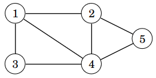
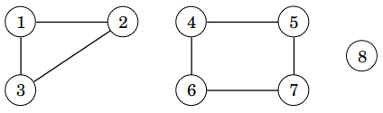
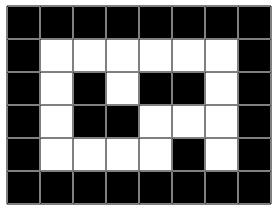

# 8. Verkkoalgoritmit

_Verkko_ (_graph_) on tietorakenne, joka muodostuu _solmuista_ (_node_) ja _kaarista_ (_edge_). Esimerkiksi seuraavassa verkossa on 5 solmua ja 7 kaarta:



Solmun _naapuri_ (_neighbor_) on toinen solmu, johon siitä pääsee kaarella. Esimerkiksi solmun 1 naapurit ovat solmut 2, 3 ja 4. Solmun _aste_ (_degree_) on naapurien määrä. Esimerkiksi solmun 1 aste on 3, koska sillä on 3 naapuria.

Kahden solmun välinen _polku_ (_path_) on kaaria pitkin kulkeva reitti. Tässä on joitakin mahdollisia polkuja solmusta 1 solmuun 5:

* 1, 2, 5
* 1, 4, 5
* 1, 3, 4, 5
* 1, 3, 4, 2, 5

Esimerkkejä verkkojen käyttötarkoituksista:

* Tieverkko: Solmut ovat kaupunkeja ja kaaret ovat teitä. Kahden solmun välinen polku vastaa kahden kaupungin välistä reittiä.
* Kontaktiverkko: Solmut ovat ihmisiä ja kaaret ovat kontakteja. Kahden solmun välinen polku kuvaa, mitä kautta ihmiset tuntevat toisensa.
* Tietoverkko: Solmut ovat tietokoneita ja kaaret ovat yhteyksiä. Kahden solmun välinen polku kuvaa, mitä kautta voidaan välittää tietoa.

## Verkot ohjelmoinnissa

Tavallinen tapa käsitellä verkkoa ohjelmoinnissa on pitää muistissa kunkin solmun _vieruslistaa_ (_adjacency list_). Solmun $$x$$ vieruslista sisältää kaikki solmut, jotka ovat yhteydessä solmuun $$x$$ kaarella.

Pythonissa voimme tallentaa verkon sanakirjana, jossa avaimet ovat solmuja ja arvot vieruslistoja. Esimerkkiverkko voidaan tallentaa seuraavasti:

```python
graph = {
    1: [2, 3, 4],
    2: [1, 4, 5],
    3: [1, 4],
    4: [1, 2, 3, 5],
    5: [2, 4]
}
```

Usein on kätevää määritellä verkkoa varten luokka, jossa on metodi kaarien lisäämiseen. Luokka voidaan toteuttaa seuraavasti:

```python
class Graph:
    def __init__(self, n):
        self.n = n
        self.graph = {node: [] for node in range(1, n + 1)}
        
    def add_edge(self, a, b):
        self.graph[a].append(b)
        self.graph[b].append(a)
```

Tässä konstruktorissa annetaan solmujen määrä `n`, jonka perusteella luodaan sanakirja `graph`, joka sisältää vieruslistat. Aluksi jokainen vieruslista on tyhjä, ja metodi `add_edge` lisää kaaren solmujen `a` ja `b` välille.

Nyt voimme luoda esimerkkiverkon näin:

```python
g = Graph(5)

g.add_edge(1, 2)
g.add_edge(1, 3)
g.add_edge(1, 4)
g.add_edge(2, 4)
g.add_edge(2, 5)
g.add_edge(3, 4)
g.add_edge(4, 5)
```

## Syvyyshaku

_Syvyyshaku_ (_depth-first search_) eli _DFS_ on menetelmä, jonka avulla voidaan käydä läpi kaikki verkon solmut, joihin pääsee lähtösolmusta kaaria pitkin. Syvyyshaku voidaan toteuttaa rekursiivisesti verkon vieruslistojen avulla.

Seuraava koodi toteuttaa syvyyshaun:

```python
class DFS:
    def __init__(self, n):
        self.n = n
        self.graph = {node: [] for node in range(1, n + 1)}
        
    def add_edge(self, a, b):
        self.graph[a].append(b)
        self.graph[b].append(a)
        
    def visit(self, node):
        if node in self.visited:
            return
        print("visit node", node)
        self.visited.add(node)

        for next_node in self.graph[node]:
            self.visit(next_node)
        
    def search(self, start_node):
        self.visited = set()
        self.visit(start_node)
```

Metodi `search` aloittaa syvyyshaun solmusta `start_node` alkaen. Metodi luo ensin joukon `visited`, johon merkitään, missä solmuissa haku on käynyt. Tämän jälkeen metodi kutsuu rekursiivista metodia `visit`, joka toteuttaa haun.

Metodi `visit` saa parametriksi vierailtavan solmun `node`. Jos haku on käynyt solmussa, metodin suoritus päättyy, ja muuten solmu lisätään joukkoon `visited`. Tämän jälkeen metodi käy läpi solmun `node` vieruslistan ja kutsuu itseään rekursiivisesti jokaiselle solmun `node` naapurille.

Seuraava koodi esittelee syvyyshaun toimintaa:

```python
d = DFS(5)

d.add_edge(1, 2)
d.add_edge(1, 3)
d.add_edge(1, 4)
d.add_edge(2, 4)
d.add_edge(2, 5)
d.add_edge(3, 4)
d.add_edge(4, 5)

d.search(1)
print("visited", d.visited)
```

Koodin tulostus on seuraava:

```python
visit node 1
visit node 2
visit node 4
visit node 3
visit node 5
visited {1, 2, 3, 4, 5}
```

### Komponentit ja yhtenäisyys

Verkon _komponentti_ (_component_) sisältää solmut, jotka ovat yhteydessä toisiinsa kaaria pitkin. Esimerkiksi seuraavassa verkossa on kolme komponenttia: $$\{1,2,3\}$$, $$\{4,5,6,7\}$$ ja $$\{8\}$$.



Verkko on _yhtenäinen_ (_connected_), jos siinä on tasan yksi komponentti eli minkä tahansa kahden solmun välillä on reitti kaaria pitkin. Esimerkiksi seuraava verkko on yhtenäinen, koska sen ainoa komponentti on $$\{1,2,3,4,5\}$$.


Esimerkiksi tieverkossa komponentti sisältää kaupungit, joiden välillä pystyy kulkemaan teitä pitkin. Tieverkko on yhtenäinen, jos minkä tahansa kahden kaupungin välillä on olemassa reitti teitä pitkin.

Syvyyshaun avulla voidaan etsiä verkon komponentit käymällä läpi verkon solmut ja aloittamalla uusi haku aina, kun vastaan tulee solmu, joka ei ole vielä missään komponentissa. Seuraava luokka `Components` toteuttaa etsinnän:

```python
class Components:
    def __init__(self, n):
        self.n = n
        self.graph = {node: [] for node in range(1, n + 1)}
        
    def add_edge(self, a, b):
        self.graph[a].append(b)
        self.graph[b].append(a)
        
    def visit(self, node):
        if node in self.components:
            return
        self.components[node] = self.counter

        for next_node in self.graph[node]:
            self.visit(next_node)
        
    def find_components(self):
        self.counter = 0
        self.components = {}

        for node in range(1, self.n + 1):
            if node not in self.components:
                self.counter += 1
                self.visit(node)
```

Muuttujassa `counter` on komponenttien määrä. Aina kun vastaan tulee solmu, joka ei ole vielä missään komponentissa, muuttujan arvo kasvaa yhdellä. Sanakirja `components` kertoo kunkin solmun komponentin, ja siihen merkitään syvyyshaun aikana nykyinen muuttujan `counter` arvo.

Luokkaa voidaan käyttää seuraavasti:

```python
c = Components(5)

c.add_edge(1, 2)
c.add_edge(3, 4)
c.add_edge(4, 5)

c.find_components()

print(c.counter) # 2
print(c.components) # {1: 1, 2: 1, 3: 2, 4: 2, 5: 2}
```

Tässä tapauksessa verkossa on kaksi komponenttia. Ensimmäinen komponentti on $$\{1,2\}$$ ja toinen komponentti on $$\{3,4,5\}$$.

## Leveyshaku

_Leveyshaku_ (_breadth-first search_) eli _BFS_ on toinen menetelmä verkon solmujen läpikäyntiin. Syvyyshaun tavoin leveyshaku aloittaa tietystä verkon solmusta ja käy kaikissa solmuissa, joihin alkusolmusta pääsee kaaria pitkin. Menetelmien erona on järjestys, jossa solmut käydään läpi.

Leveyshaku voidaan toteuttaa seuraavasti:

```python
class BFS:
    def __init__(self, n):
        self.n = n
        self.graph = {node: [] for node in range(1, n + 1)}

    def add_edge(self, a, b):
        self.graph[a].append(b)
        self.graph[b].append(a)

    def search(self, start_node):
        self.visited = set()

        queue = [start_node]
        self.visited.add(start_node)

        for node in queue:
            print("visited", node)
            for next_node in self.graph[node]:
                if next_node not in self.visited:
                    queue.append(next_node)
                    self.visited.add(next_node)
```

Ideana on luoda lista `queue`, jossa on jono käsiteltävistä solmuista. Ensin listalle laitetaan alkusolmu `start_node`. Joka askeleella haku ottaa käsittelyyn seuraavan solmun `node` jonosta ja käy läpi solmun vieruslistan. Haku lisää jonon loppuun kaikki solmut, joihin solmusta `node` pääsee ja joita ei ole lisätty aiemmin.

Seuraava koodi esittelee leveyshaun toimintaa:

```python
b = BFS(5)

b.add_edge(1, 2)
b.add_edge(1, 3)
b.add_edge(1, 4)
b.add_edge(2, 4)
b.add_edge(2, 5)
b.add_edge(3, 4)
b.add_edge(4, 5)

b.search(1)
print(b.visited)
```

Koodin tulostus on seuraava:

```
visited 1
visited 2
visited 3
visited 4
visited 5
{1, 2, 3, 4, 5}
```

### Lyhimmät polut

Kahden verkon solmun välinen _lyhin polku_ (_shortest path_) on niiden välinen reitti, jossa on mahdollisimman vähän kaaria. Solmujen _etäisyys_ (_distance_) on niiden välisen lyhimmän polun pituus.

Esimerkiksi seuraavassa verkossa lyhin polku solmusta 1 solmuun 5 on kulkea ensin solmusta 1 solmuun 4 ja sitten solmusta 4 solmuun 5. Lyhimmällä polulla on 2 kaarta, joten solmujen 1 ja 5 etäisyys on 2.


Leveyshaun ominaisuutena on, että se käy solmut läpi järjestyksessä sen mukaan, mikä on niiden etäisyys lähtösolmusta. Tämän ansiosta leveyshakua voidaan käyttää verkon lyhimpien polkujen etsimiseen. Leveyshaulla voidaan etsiä lyhimmät polut lähtösolmusta kaikkiin muihin solmuihin.

Seuraava luokka etsii lyhimmät polut lähtösolmusta alkaen:

```python
class ShortestPaths:
    def __init__(self, n):
        self.n = n
        self.graph = {node: [] for node in range(1, n + 1)}

    def add_edge(self, a, b):
        self.graph[a].append(b)
        self.graph[b].append(a)

    def find_paths(self, start_node):
        self.distances = {}
        self.previous = {}

        self.distances[start_node] = 0
        self.previous[start_node] = None
        queue = [start_node]

        for node in queue:
            distance = self.distances[node]
            for next_node in self.graph[node]:
                if next_node not in self.distances:
                    self.distances[next_node] = distance + 1
                    self.previous[next_node] = node
                    queue.append(next_node)
```

Sanakirja `distances` sisältää etäisyydet lähtösolmusta kaikkiin solmuihin, joihin pääsee kulkemaan kaaria pitkin. Kun solmu tulee vastaan leveyshaussa, sen etäisyydeksi asetetaan yhtä suurempi kuin edellisen solmun etäisyys.

Sanakirja `previous` sisältää kunkin solmun edellisen solmun lyhimmällä polulla. Tämän sanakirjan avulla voidaan leveyshaun jälkeen etsiä käänteisessä järjestyksessä solmut, jotka ovat lyhimmän polun varrella.

Esimerkiksi seuraava koodi etsii lyhimmät polut solmusta 1 alkaen, tulostaa etäisyydet solmuihin sekä etsii solmuun 5 johtavan lyhimmän polun.

```python
s = ShortestPaths(5)

s.add_edge(1, 2)
s.add_edge(1, 3)
s.add_edge(1, 4)
s.add_edge(2, 4)
s.add_edge(2, 5)
s.add_edge(3, 4)
s.add_edge(4, 5)

s.find_paths(1)

print(s.distances) # {1: 0, 2: 1, 3: 1, 4: 1, 5: 2}

node = 5
path = []
while node:
    path.append(node)
    node = s.previous[node]
    
path.reverse()
print(path) # [1, 2, 5]
```

Huomaa, että polun etsinnässä polku muodostuu takaperin, koska sanakirja `previous` kertoo edellisen solmun polulla. Tämän takia polku käännetään ympäri metodilla `reverse` ennen tulostamista.

## Labyrintti verkkona

Tarkastellaan seuraavaa labyrinttia, jossa valkoiset ruudut ovat lattiaa ja mustat ruudut ovat seinää:



Voimme käyttää syvyys- ja leveyshakua reittien etsimiseen labyrintissa. Tässä tapauksessa voimme ajatella, että verkon solmuja ovat labyrintin lattiaruudut ja kahden solmun välillä on kaari, jos ruudut ovat vierekkäin labyrintissa.

Yksi tapa toteuttaa haku olisi rakentaa ensin verkko labyrintin kuvauksen perusteella. Kuitenkin voimme myös toteuttaa haun suoraan labyrinttiin. Seuraava koodi näyttää, miten voimme käydä läpi labyrintin ruudut syvyyshaun avulla:

```python
def explore(grid, y, x):
    if grid[y][x] != 0:
        return

    print("visit", y, x)
    grid[y][x] = 2

    explore(grid, y-1, x)
    explore(grid, y+1, x)
    explore(grid, y, x-1)
    explore(grid, y, x+1)

grid = [[1,1,1,1,1,1,1,1],
        [1,0,0,0,0,0,0,1],
        [1,0,1,0,1,1,0,1],
        [1,0,1,1,0,0,0,1],
        [1,0,0,0,0,1,0,1],
        [1,1,1,1,1,1,1,1]]

explore(grid, 1, 1)

for row in grid:
    print(row)
```

Labyrintti on tallennettuna kaksiulotteisena listana, jossa luku 0 tarkoittaa lattiaruutua ja luku 1 tarkoittaa seinäruutua. Funktio `explore` suorittaa syvyyshaun labyrintissa niin, että lattiaruutuihin merkitään luku 2.

Funktio `explore` tarkastaa ensin, mikä luku annetussa ruudussa on. Jos luku ei ole 0, funktio päättyy heti, koska kyseessä on silloin seinäruutu tai lattiaruutu, jossa on jo käyty aiemmin. Jos luku on 0, funktio jatkuu ja merkitsee ruutuun luvun 2. Tämän jälkeen funktio jatkaa rekursiivisesti hakua ruudun viereisiin ruutuihin ylös, alas, vasemmalle ja oikealle.

Koodin suoritus antaa seuraavan tuloksen:

```
visit 1 1
visit 2 1
visit 3 1
visit 4 1
visit 4 2
visit 4 3
visit 4 4
visit 3 4
visit 3 5
visit 3 6
visit 2 6
visit 1 6
visit 1 5
visit 1 4
visit 1 3
visit 2 3
visit 1 2
visit 4 6
[1, 1, 1, 1, 1, 1, 1, 1]
[1, 2, 2, 2, 2, 2, 2, 1]
[1, 2, 1, 2, 1, 1, 2, 1]
[1, 2, 1, 1, 2, 2, 2, 1]
[1, 2, 2, 2, 2, 1, 2, 1]
[1, 1, 1, 1, 1, 1, 1, 1]
```
